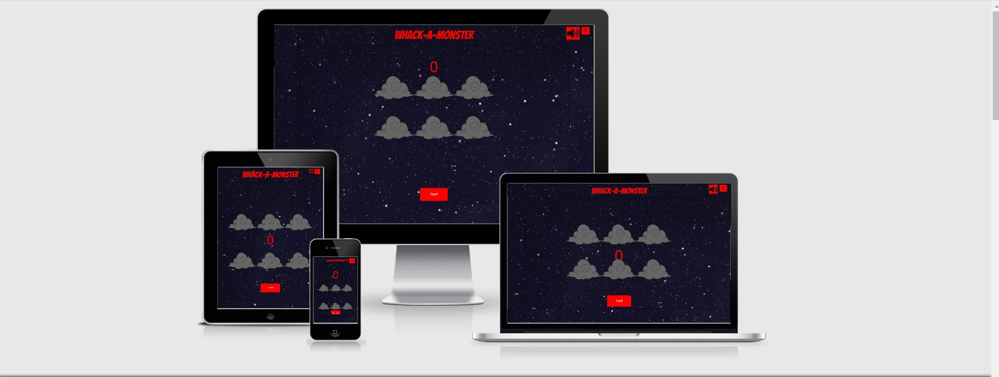

# Whack-a-Monster




**[Live demo](https://dovi-k.github.io/whack-a-monster-ms2/.)**

---

<span id="top"></span>

## Index

- <a href="#context">Context</a>
- <a href="#ux">UX</a>
  - <a href="#ux-overview">Overview</a>
  - <a href="#ux-stories">User stories</a>
  - <a href="#ux-wireframes">Wireframes</a>
  - <a href="#ux-design">Design</a>

- <a href="#features">Features</a>
- <a href="#technologies">Technologies Used</a>
  - <a href="#testing-responsive">Responsiveness</a>
  - <a href="#testing-unresolved">Unresolved issues</a>
- <a href="#deployment">Deployment</a>
- <a href="#code">Code sourses</a>
- <a href="#credits">Credits</a>

---

<span id="context"></span>

## Context

"Whack-a-Monster" is is inspired by arcade and fair game "Whack a Mole." In this game the mole is replaced with cute pink monster beautiful artwork from 
[Bevouliin](https://bevouliin.com/) and the action takes in space and the hoels are replaced with stardust clouds.
This game is for all ages. It will definetly challenge you and test your focus and reaction.


The game is simple:

- Hit as many pink monsters as you can in 30 second using the right mouse click, earn points with every click.
- You can multiclick on the  monsters for extra points before they disapear.
- If you reach 35 points before the times runs out you get additional 10 seconds, keep collecting
35 points to keep playing before time runs out.

Since there are no extra levels to this game, I made it harder. So that it would take your full focus
to keep earning the points and feel challenged to get the next 35 points before the timer runs out.
You snooze you looze!

<div align="right"><a style="text-align:right" href="#top">Go to index :arrow_double_up:</a></div>
<span id="ux"></span>

## UX

<span id="ux-overview"></span>

### Overview

Design decisions have been made with the following goals in mind:

- Mobile-first
- Simplicity
- Intuitive navigation
- Easy controls
- Satisfying feedback
- Replayable


I've asked couple of my friends to play the game and leave first impressions:

- Friend1: "It's more difficult that it seems. Oh Actually it's great fun!"
- Friend2: "It's great! I played it on my phone. Such a trip down memory lane playing these kind of 
games. The only thing that kept happening when I was double tapping the monsters
my screen would zoom in"
- Friend3: 

<span id="ux-stories"></span>

### User stories

#### As a player I want:

- As a user, I want easy controls
- As a user, I want to feel entertained
- As a user, I want to feel challenged
- As a user, I want to have satisfying audio and visuals
- As a user, I want to have a clear way how to start and restart a game when the game ends
- As a user, I want to see my progression in the game by keeping the score
- As a user, I want to feel motivated to keep playing 

#### As a developer/site owner I want:

- To be able to customise the look and feel of the game easily
- To keep players entertained and coming back to my website


<span id="ux-wireframes"></span>

### Wireframes

Wireframes for **mobile** and **desktop** can be accessed [here](wireframes/wireframes.pdf).

The wireframes were changing as the game ideas where shifting I started with the game idea of endless runner and the first wrireframe was created for that,
the second idea was FlappyBird I had a wireframe created for that, but as I went throuogh the process it tuned out to be the Whack a Mole type of game
so the game came first and the wireframes after in this case.

For the mobile responsiveness and smaller screens I tried to do the portrait view, but it to adjust responsiveness for that would have taken too much time
and vertical view proved itself to be estetically pleasing and practical for this game.


<span id="ux-design"></span>

### Design choices

#### Colours

It is a Space themed game. 
The colour palette is very simple I sticked to 2 main colors for styling and continuity.
The bright red buttons plays is a nicely complements and the deep blue starry space background and 
grey startdust clouds. The Pink monster stand out from the background creates a nice contrast with the rest of the game board,
and draws the players attenstion.

I used two pink monster sprites in this one for poping out, the other one for getting hit, which adds interactivity to the game.
and improves UX as well as thhe sound that comes with the hit, which you have an oportunity to mute.


-  #ff0000 (Red)
-  #010124 (Deep Blue)


#### Fonts

- [Bangers](https://fonts.google.com/specimen/Bangers#about) back up font "cursive".
- [Helvetica](https://fonts.google.com/specimen/Helvetica#about) back up font "sans-serif".

For consistency and simplicity this is the only font I used.

#### Audio

Audio I kept very simple uplifting and space related. I wanted backgound music and a smack sound to start once you hirt the Start! 
when you hit the monster. 

- Music starts playing when you hit the "Start!" button.
- Background music can be muted/unmuted using the sound button at the top of the game board.
- Game Theme song is taken from [Serpent Sound Studios](https://www.serpentsoundstudios.com/royalty-free-music/techno-electronic)
it is called Beat Three. It has Techno/Futuristic feel to it.
- Smack sound is taken from [Free Sound](https://freesound.org/people/Joecrazy3193/sounds/458648/) and was edited using 
[Wave Pad Audio Editing Software](https://wavepad.en.softonic.com/)


<div align="right"><a style="text-align:right" href="#top">Go to index :arrow_double_up:</a></div>

<span id="code"></span>

## Code Sources

### Code I used from other sources

- [Franks Laboratory](https://www.youtube.com/watch?v=RTb8icFiSfk&t=289s&ab_channel=Frankslaboratory)
inpiration and the main game functions along with some styling parameters were taken and modified from this Game Development with JavaScript for Beginners
 tutorial. 
- Mute/Unmute button [Stack Overflow](https://stackoverflow.com/questions/22918220/how-to-create-a-only-mute-unmute-button-like-youtube-in-html)
- [Bootstrap modal](www.getbootrap.com) the modal used for the instructions
- README.md file structure inspired some code taken from [Edb83](https://github.com/Edb83/snake) project

### Student projects that inspired me
- [Andy Osbourne "Dwarf Match"](https://github.com/Andy-Osborne/Dwarf-Match) - great fun, project, with beautiful visuals, different
levels, I took a lot of inspiration from this game and it gave me an idea of what kind of game and 
visuals I would like to create. I play this game myslef sometimes.
- Sam Laubcher [Stellar-Drift](https://github.com/samlaubscher/Stellar-Drift-Game-M2/) - just for ideas, user interactions
- [Steven Nicholson](https://github.com/bicks79/ShowMeWhatYouGot) - inspiration, UX, interactivity
- [Cyber Snake game by Edb83(GitHub) ](https://github.com/Edb83/snake)

### Youtube tutorials that inspired me
- [PothonPrograming channel](https://www.youtube.com/watch?v=LZ0w3HAQKWU&ab_channel=PothOnProgramming)- endless runner game
- [KnifeCircus youtube channel](https://www.youtube.com/watch?v=bG2BmmYr9NQ&ab_channel=KnifeCircus)-endless runner game
- [Flappy Bird](https://www.youtube.com/watch?v=3SsYZDJdeXk&t=134s&ab_channel=KnifeCircus)
- [FranksLabaratory](https://www.youtube.com/watch?v=lGJ9i6CYKyQ&ab_channel=Frankslaboratory)- flappy bird

<span id="features"></span>


## Features


### Features I would like to implement in the future

- I would like to implement restart game button, so you owuldn't have to wait
for the timer to run out or hit refresh to start a new game. (that woudl make the game more user friendly)
- I would like to add different difficulty levels Easy/Medium/Hard and be able to adjust the speed of the game accordingly
- I would like to have implement different levels of the so the player could be progressing
- I would like to impelment having 3 game lives, so the player  could save points and keep building on them without 
completely loosing their progress
- I would like to implemment High-Score board, so the players could see how well they're doing compared to others


<div align="right"><a style="text-align:right" href="#top">Go to index :arrow_double_up:</a></div>

<span id="technologies"></span>

## Technologies Used

### Languages

- HTML
- CSS
- Javascript
 

### Project management

- [Balsamiq](https://balsamiq.com/wireframes/) - Wireframe creation tool
- [GitHub](https://github.com/) - Version control and deployment
- [GitPod](https://gitpod.io/) - IDE used to code the game


### Style and theme


- [Google Fonts](https://fonts.google.com/) - 
- [Colorswall](https://colorswall.com/palette/360/) for the hex values
- [Bootstrap](www.getbootsrap.com)

### Online resources

- [Am I Responsive?](http://ami.responsivedesign.is/) - to produce the README showcase image

<div align="right"><a style="text-align:right" href="#top">Go to index :arrow_double_up:</a></div>

<span id="testing"></span>

## Testing

<span id="testing-auto"></span>

### Automated testing

[Chrome DevTools](https://developers.google.com/web/tools/chrome-devtools) - audit summary for both desktop and mobile:


[W3C - HTML](other/Htmlval.jpg) - 0 errors, 0 warnings - **PASS** 

[W3C - CSS](other/CSSval.jpg) - 0 errors, 2 warnings - **PASS**

- Imported style sheets are not checked in direct input and file upload modes
- Imported style sheets are not checked in direct input and file upload modes

[JS Hint](other/JSval.jpg) - 0 errors,  18 warnings - **PASS**
I've added screenshot of the warnings. In future release I would clear the warnings. Likewise for CSS.

<span id="testing-manual"></span>

### Manual testing

**Summary**:

I've spend hours spent testing Whack-a-Monster throughout
its development. I may have not ducomented every single one of the tests.
I haven't htoroughly documented most of my test. I have worked quite a lot on Responsiveness
even though the result is still far from being perfect.
A lot of tests were caried out to test the JS functions for the game.


<span id="testing-responsive"></span>

### Responsiveness 

I have written more about the responsiveness issues i've been facing while trying to 
finsih up my project more in detai in the [Testing file](testing.md)

- I wasn't able to test the XL screens as I was not an owner of one, the only time that I got to see it, was through
my and my mentor screenshare, however I've added extra media query hoping that that would solve the issue,
ehich was the score is apearing behind the lower row middle cloud.


#### Browsers

Tested on:

- Chrome
- Edge
- Firefox
- Opera

#### Screen sizes

Tested with Chrome DevTools using profiles for:

- Moto G4
- Galaxy S5
- Pixel 2
- Pixel 2 XL
- iPhone 5 SE
- iPhone 6/7/8
- iPhone 6/7/8 Plus
- iPhone X
- iPad
- iPad Pro

... and also using the responsive profiles of:

- Mobile S (320px)
- Mobile M (375px)
- Mobile L (425px)
- Tablet (768px)
- Laptop (1024px)
- Laptop L (1440px)

Real world testing on:

- Samsung Galaxy S8
- HP 18' Laptop


### Issues and resolutions

<span id="testing-unresolved"></span>


#### Unresolved
* Music gets delayed depending on the browser or the device few second.
* The Information button is not responsive
* The mute button doesn't resize properly and both buttons on different sizes
gets out of alignment
* Score gets hidden on medium-large screens behind the clouds
* start button doesn't resize properly on small screens, part of it might get hidden on vbery small screens.
* bug reported by the user "sometimes double taps in the touch screen devices zoom in the screen" 
* restart button is missing in the game if you started a game you need to refresh the page
or wait until the timer runs out

<div align="right"><a style="text-align:right" href="#top">Go to index :arrow_double_up:</a></div>

<span id="deployment"></span>

## Deployment

I was working on one branch (master) and the deployed version of this site is the most current version in the repository.


To deploy this page to GitHub Pages from its [GitHub repository](https://github.com/Edb83/snake), I took the following steps:

1. From the menu items near the top of the page, select **Settings**
2. Scroll down to the **GitHub Pages** section
3. Under **Source** click the drop-down menu labelled **None** and select **Master Branch**
4. On selecting Master Branch the page will be automatically refreshed and the website is now deployed
5. Scroll back down to the **GitHub Pages** section in **Settings** to retrieve the link to the deployed website. It may take a short time to go live, but typically less than 60 seconds

### How to run locally

To clone this project from GitHub:

1. Under the repository name, click **Clone or download**
2. In the **Clone with HTTPs** section, copy the clone URL for the repository
3. In your local IDE open Git Bash
4. Change the current working directory to the location where you want the cloned directory to be made
5. Type `git clone`, and then paste the URL you copied in Step 2

```console
git clone https://github.com/dovi-k/whack-a-monster-ms2
```

6. Press Enter. Your local clone will be created

Further reading and troubleshooting on cloning a repository from GitHub can be found [here](https://help.github.com/en/articles/cloning-a-repository).

<div align="right"><a style="text-align:right" href="#top">Go to index :arrow_double_up:</a></div>

<span id="credits"></span>
<span id="code"></span>

## Code Sources

### Code I used from other sources

- [Franks Laboratory](https://www.youtube.com/watch?v=RTb8icFiSfk&t=289s&ab_channel=Frankslaboratory)
inpiration and the main game functions along with some styling parameters were taken and modified from this Game Development with JavaScript for Beginners
 tutorial. 
- Mute/Unmute button [Stack Overflow](https://stackoverflow.com/questions/22918220/how-to-create-a-only-mute-unmute-button-like-youtube-in-html)
- [Bootstrap modal](www.getbootrap.com) the modal used for the instructions
- README.md file structure inspired some code taken from [Edb83](https://github.com/Edb83/snake) project
- README.md and test.md file structure inspired by [Andy Osbourne "Dwarf Match"](https://github.com/Andy-Osborne/Dwarf-Match)

### Student projects that inspired me
- [Andy Osbourne "Dwarf Match"](https://github.com/Andy-Osborne/Dwarf-Match) - great fun, project, with beautiful visuals, different
levels, I took a lot of inspiration from this game and it gave me an idea of what kind of game and 
visuals I would like to create. I play this game myslef sometimes.
- Sam Laubcher [Stellar-Drift](https://github.com/samlaubscher/Stellar-Drift-Game-M2/) - just for ideas, user interactions
- [Steven Nicholson](https://github.com/bicks79/ShowMeWhatYouGot) - inspiration, UX, interactivity
- [Cyber Snake game by Edb83(GitHub) ](https://github.com/Edb83/snake)

### Youtube tutorials that inspired me
- [PothonPrograming channel](https://www.youtube.com/watch?v=LZ0w3HAQKWU&ab_channel=PothOnProgramming)- endless runner game
- [KnifeCircus youtube channel](https://www.youtube.com/watch?v=bG2BmmYr9NQ&ab_channel=KnifeCircus)-endless runner game
- [Flappy Bird](https://www.youtube.com/watch?v=3SsYZDJdeXk&t=134s&ab_channel=KnifeCircus)
- [FranksLabaratory](https://www.youtube.com/watch?v=lGJ9i6CYKyQ&ab_channel=Frankslaboratory)- flappy bird


### Content

- All text within the game is original content


### Acknowledgements

- Precious Iljege (Code Institute Mentor) - for his reassurance, support and guidance
- Tutors Tim, Miklos, Johann, Scott - for support and dedication helping me to debug my code and helping me to move forward
with project, when I would end up in a blind spot.
- Alex Bitar, my friend, who kept me motivated and supported me through my stuggle with JavaScript


### Disclaimer

This game was developed for educational purposes.

<div align="right"><a style="text-align:right" href="#top">Go to index :arrow_double_up:</a></div>
