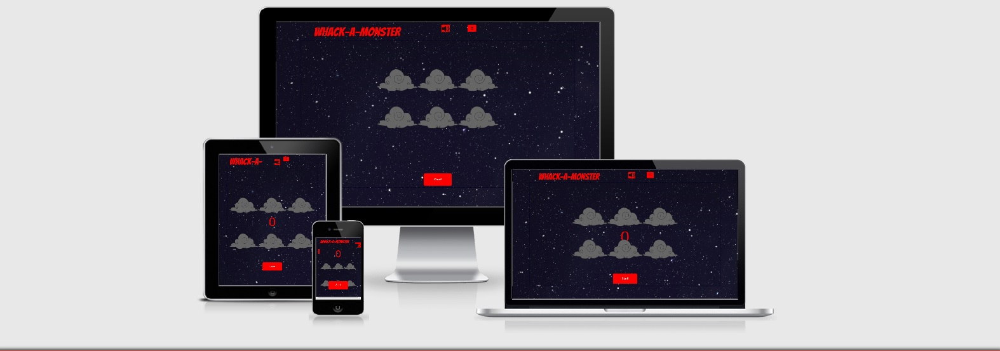

## Responsiveness

I used mostly Dev tools and different screen sizes it provided to test my game
screen. When I used ["Am I responsive?"](http://ami.responsivedesign.is/#)
website it highlighted a whole new array of responsoveness issues.

1. First I started with the smallest size, so as you can see in the img above
the "start!" button is way to big for the screen and it covers, 2 clouds. 
Even though the button disapears once you hit "start!" and reapears only whn the timer is out.
This responsivesness issue did not apear on any of the Dev tools screens.
